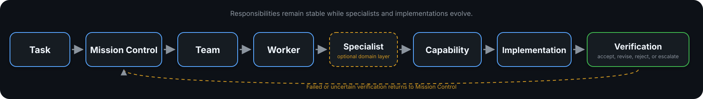

<p align="center">
  
</p>

<div align="center">

# The Ever-Evolving Orchestration

### Models evolve. Responsibilities endure.

A publicly viewable, vendor-neutral orchestration specification with a runnable reference control plane for coordinating intelligent systems through teams, workers, specialists, capabilities, implementations, fallbacks, and independent verification.

**Navigate by principles. Adapt by evidence.**

[](https://github.com/vessaxor-spec/The-ever-evolving-orchestration-/actions/workflows/reference-ci.yml)

</div>

---

Every few months, the AI landscape changes.

New models appear. Existing models improve. Providers change limits, pricing, context windows, tool access, and reliability. Systems built around a permanent model hierarchy become brittle as soon as those assumptions move.

TEO starts from a different premise:

> **The model is not the architecture.**

Responsibilities change slowly. Capabilities evolve gradually. Implementations change constantly.

The Ever-Evolving Orchestration separates those layers so a system can adopt better implementations without repeatedly redesigning how work is understood, assigned, executed, challenged, and verified.

## What is TEO?

TEO is a publicly viewable orchestration specification and reference implementation for answering one durable question:

> **How should an intelligent system decide which intelligence to use, under what authority, with which fallback, and with what verification?**

TEO provides a structured way to:

- interpret and classify a task
- assess risk and constraints
- identify the accountable team
- select the appropriate worker
- activate a domain specialist when useful
- resolve the required capabilities
- choose an eligible implementation
- assign a provider-aware fallback
- require independent verification proportional to risk
- record the dispatch, evidence, outcome, and escalation path
- improve routing through conformance tests and observed results

TEO combines human-readable architecture with machine-readable routing policies, specialist bindings, worker registries, model metadata, conformance fixtures, and a runnable Python control plane.

It is intended for engineers, AI agents, researchers, and organizations building multi-model or multi-agent systems that must remain understandable as implementations change.

## Current project state

The repository now contains:

- ten active organizational teams: Mission Control, Planning, Engineering, Platform and Reliability, Systems Engineering, Physical Systems, Research, Assurance, Review, and Verification
- a public roster of 78 preserved specialist role cards, each with a deterministic Team -> Worker -> Specialist spawn path
- machine-readable team, worker, specialist, capability, model, fallback, verification, retry, provider-health, runtime-telemetry, calibration, and empirical-evidence policies
- dedicated Mission Control workers for orchestration, operations, project delivery, and incident response
- dedicated Platform and Reliability workers for distributed systems, database reliability, networks, platforms, performance, FinOps, SRE, MLOps, DevOps, and DevSecOps
- dedicated Systems Engineering responsibility for requirements, interfaces, baselines, integration, and lifecycle coherence
- dedicated Physical Systems workers for hardware, embedded, civil, robotics, silicon, aerospace, and manufacturing
- dedicated Research Team workers for broad research, user research, market research, analytics, applied science, and documentation
- dedicated Assurance workers for privacy engineering, functional safety, formal methods, and application security
- dedicated Review Team workers for code review and compliance review
- deterministic task classification for established routes and explicit task types for principal-engineering routes
- a non-lowerable effective-risk floor derived from task content, caller declaration, specialist profile, and policy
- specialist-driven risk elevation and qualified human approval for critical effective risk
- effort-aware specialist model refinement across all 78 active specialists
- capability and worker-implementation eligibility checks before execution selection
- explicit task-level authorization before preview implementations may be selected
- provider-aware routine fallbacks and independent provider-diverse verification
- conditional escalation separated from ordinary availability fallback
- a connection-neutral provider boundary that keeps API keys, OAuth, delegated identity, service accounts, connector sessions, and other access mechanisms outside routing semantics
- guarded live provider adapters for Anthropic Claude Haiku 4.5, OpenAI GPT-5.6 Luna, and Google Gemini 3.6 Flash
- bounded same-dispatch retry for transient failures
- provider-directed minimum retry timing without transferring retry authority to providers
- guarded model/provider fallback through a new canonical redispatch and fresh independent verifier
- persistent provider-family circuit state with Closed, Open, and Half-Open recovery
- persistent content-free provider-attempt telemetry for latency, failure state, retry timing, verifier identity, and normalized token usage using opaque runtime correlation rather than caller-controlled task identifiers
- guarded one-shot live execution of the dispatch-assigned provider-diverse verifier using structured pointwise criteria
- authorized-root confinement for live verification artifacts and explicit treatment of candidate output as untrusted data
- a fixed verifier-calibration control corpus with deterministic checks, strict observation contracts, repeatability and disagreement metrics, and mutation resistance
- an empirical verifier-calibration protocol that requires blinded independent human labels before human-backed live observations, three provider-diverse verifier routes, three repeated runs per case per route, measured duration, provider-reported token usage, and route-specific quality reporting
- blinded human-review packet generation using random review-item aliases, a separate private alias map, a two-reviewer minimum, and distinct adjudication when reviewers disagree
- a separate provisional machine-panel evidence tier for periods when independent human reviewers are unavailable, using three provider-diverse blinded machine judges whose exact models differ from the verifier routes being evaluated
- separate content-free schemas and evidence semantics for machine-panel labels and provisional live observations so machine evidence cannot be silently represented as human-rated evidence
- strict separation between calibration evidence and routing authority: complete or favorable measurements do not automatically change routes, authorize quality claims, or expand live execution scope
- strict JSON Schema enforcement at external task, dispatch, execution, verification, final-outcome, human-review, human-label, machine-panel, and empirical-observation boundaries
- clean linked-configuration validation, including all-78 specialist spawnability, routed-model registration, model-registry consistency, and explicit verifier-diversity checks
- worker and routing conformance datasets, including 27 principal-engineering cases
- a six-card regulated evidence/freshness pilot with CI validation and mutation testing
- a runnable Python reference router with validation, planning, finalization, runtime execution controls, live verification, calibration tooling, and audit output
- reproducible reference CI with pinned runner, Python version, action commits, and validation dependencies
- CI that compiles the implementation, runs the tests, validates regulated evidence, parses schemas, validates linked configuration, and executes the end-to-end example

The control plane remains intentionally inspectable. Guarded live execution and live model verification are currently limited to explicit `high_volume_simple` work at low or medium effective risk. Provider adapters remain single-attempt and stateless; retry, fallback, provider-health state, telemetry, verification, calibration, and approval remain separate control layers. Telemetry does not persist prompts or model outputs by default and does not calculate cost or quality. The calibration instrument, human-review workflow, and empirical collection machinery are implemented, but TEO does not yet claim measured verifier quality. The stronger evidence path remains independent blinded human review followed by 72 repeated live verifier observations. When independent human reviewers are unavailable, TEO now permits a separate provisional path consisting of 24 blinded judgments from three provider-diverse machine judges followed by the same 72-call verifier study, for 96 planned live calls in total. That provisional path measures reference-control performance and cross-provider machine consensus but does not constitute human ground truth and cannot authorize routing changes, quality claims, automatic route updates, or broader live execution. Distributed circuit-state coordination, distributed telemetry export, streaming, source-backed cost attribution, route-outcome learning, and qualified-human approval integration remain later runtime work.

## Core architecture

<p align="center">
  
</p>

```text
Task
  |
  v
Mission Control
  |
  v
Team
  |
  v
Worker
  |
  v
Optional Specialist
  |
  v
Capability
  |
  v
Implementation
  |
  +--> Routine fallback
  |
  +--> Conditional escalation
  |
  v
Independent verification
  |
  v
Evidence-bearing outcome
```

A task is not routed directly to a model until the system has resolved the responsibility, worker, optional specialist, capability, risk, fallback, and verification requirements behind that choice.

The Specialist layer is optional. It narrows a stable worker responsibility to a domain without replacing the owning team, weakening the worker, or changing the authority chain.

This hierarchy is designed to remain stable even when model names, providers, prices, quotas, context limits, or tool capabilities change.

## Core principles

### Team-first

Route work to an accountable responsibility before selecting an implementation.

### Capability-first

Resolve what the task requires before considering a provider or model.

### Evidence-first

Change routing through validation, measured outcomes, documented limitations, and explicit conformance updates rather than preference.

### Authority before autonomy

Workers and specialists operate inside declared responsibilities, escalation conditions, and human-approval boundaries.

### Independent verification

Consequential work must not rely on the same implementation as sole planner, executor, reviewer, and verifier.

### Failure-aware fallback

Fallback decisions must account for whether a failure is request-specific, transient, model-specific, provider-scoped, or capability-scoped.

## Team-first orchestration

TEO treats orchestration as an organizational problem before treating it as a model-selection problem.

### Mission Control

Mission Control receives the task, interprets intent, assesses risk, selects the accountable route, coordinates work, and determines the verification path.

Its dedicated workers currently include:

| Worker | Responsibility |
|---|---|
| `orchestration` | governed multi-agent pipelines, handoffs, state, recovery, and termination |
| `operations` | operational controls, vendors, processes, approvals, dependencies, and accountable execution |
| `project_delivery` | scope, capacity, critical path, risk, change control, and delivery commitments |
| `incident_response` | severity, roles, cadence, timeline, communications coordination, resolution readiness, and blameless learning |

Mission Control does not absorb specialist work. It owns dispatch, coordination, authority boundaries, and completion.

### Planning Team

The Planning Team handles architecture, decomposition, dependency analysis, sequencing, tradeoff evaluation, and irreversible-choice review.

Planning resolves structural decisions before Engineering executes them. Consequential architecture remains subject to executable feasibility checks and independent review.

### Engineering Team

The Engineering Team handles application and product implementation, debugging, testing, refactoring, migrations, language-specific engineering, and tool execution.

Its active responsibilities include backend, frontend, mobile, compiler and toolchain engineering, database application work, data engineering, AI engineering, Rust systems programming, game engineering, and XR development.

Data engineering builds and maintains data movement and transformation systems. It does not own analytical interpretation merely because the input is data.

### Platform and Reliability Team

The Platform and Reliability Team owns the shared technical foundations on which software and services are built and operated.

Its active responsibilities include distributed systems, database reliability, network engineering, platform engineering, performance engineering, FinOps, site reliability, MLOps, DevOps, and DevSecOps.

Platform and Reliability does not absorb application implementation, system requirements, security approval, or incident-command authority.

### Systems Engineering Team

The Systems Engineering Team maintains lifecycle coherence across software, hardware, people, data, processes, facilities, suppliers, and operations.

It owns stakeholder needs, system requirements, allocation, interfaces, technical baselines, integration strategy, change impact, and system verification and validation planning.

Systems engineering is not systems programming. Rust remains an Engineering Team language specialty through the `rust_systems_programming` worker.

### Physical Systems Team

The Physical Systems Team owns engineering whose correctness depends on physical behavior and real-world integration.

Its active responsibilities include hardware, embedded systems, civil engineering, robotics and autonomy, silicon and ASIC engineering, aerospace and satellite systems, manufacturing, and physical integration.

Critical physical-system decisions remain subject to Systems Engineering handoff, independent verification, and qualified human approval.

### Assurance Team

The Assurance Team builds technical assurance requirements, controls, analyses, and evidence for privacy engineering, functional safety, selected formal correctness, and application security.

Assurance does not approve its own consequential claims. Review challenges the argument, Verification checks the evidence, and qualified humans retain critical release and residual-risk authority.

### Research Team

The Research Team now distinguishes several forms of evidence work that should not be collapsed into one generic worker.

| Worker | Responsibility |
|---|---|
| `research` | source discovery, triangulation, contradiction analysis, confidence calibration, and research synthesis |
| `user_research` | interviews, surveys, usability findings, feedback themes, JTBD framing, persona evidence, mixed-method triangulation, and user-insight synthesis |
| `market_research` | competitive landscapes, bounded market sizing, lifecycle analysis, weak signals, willingness-to-pay, and strategic market evidence |
| `analytics` | quantitative analysis, KPI diagnostics, experiments, funnels, cohorts, forecasting, attribution, and model QA |
| `documentation` | accurate, usable, maintainable technical documentation and reference material |

These workers collaborate but remain distinct:

- research synthesis is not quantitative analytics
- user research is not market intelligence, quantitative analytics, documentation, or UX-design judgment
- market intelligence is not broad-domain research
- analytics is not data-pipeline engineering
- documentation is not the owner of substantive research
- none of these workers substitutes for the accountable business decision-maker

### Review Team

The Review Team challenges assumptions, reviews architecture and code, checks requirements alignment, identifies hidden risks, and escalates consequential decisions.

Its dedicated workers currently include:

| Worker | Responsibility |
|---|---|
| `code_review` | correctness, minimal-change discipline, contracts, regression risk, and AI-authored code review |
| `compliance` | regulatory applicability, control mapping, audit evidence, privacy and AI governance, third-party risk, and human-gated remediation decisions |

Review also includes semantic challenge, adversarial reasoning, security analysis, performance review, accessibility review, and contract integrity checks. Compliance does not issue legal opinions, audit certifications, or technical implementations.

### Verification Team

The Verification Team determines whether execution satisfied the original requirements and whether the evidence is sufficient to accept the result.

Verification may include:

- output validation
- targeted review
- executable tests
- source grounding
- statistical recalculation
- changed-contract review
- rollback or recovery planning
- independent multi-agent review
- qualified human approval

Verification strictness increases with effective risk, including risk elevated by an activated specialist.

## Implemented reference routes

The current control plane includes first-class routes for:

| Route | Primary responsibility |
|---|---|
| `orchestration` | multi-agent pipeline design and governance |
| `operations` | operational process and control coordination |
| `project_delivery` | project planning and delivery governance |
| `incident_response` | production incident command and coordination |
| `architecture_design` | system architecture and structural tradeoffs |
| `daily_coding` | routine implementation and testing |
| `deep_debugging` | root-cause analysis and repair |
| `repo_wide_refactor` | phased repository-scale structural change |
| `deep_research` | broad evidence gathering and synthesis |
| `user_research` | qualitative user evidence and feedback synthesis |
| `market_research` | current market and competitive intelligence |
| `analytics` | quantitative and statistical analysis |
| `code_review` | correctness, scope, contracts, and regression review |
| `compliance_review` | critical compliance applicability, controls, evidence, privacy, and AI-governance review |
| `security_review` | critical security analysis and verification |
| `multimodal_analysis` | visual and multimodal interpretation |
| `high_volume_simple` | economical classification, extraction, and transformation |
| `documentation` | technical writing and reference maintenance |
| `release` | release readiness, artifacts, versioning, and rollback confirmation |

Principal-engineering routes are also active through explicit task types:

| Route | Primary responsibility |
|---|---|
| `cloud_architecture` | cloud placement, landing zones, migration, governance, economics, and exit |
| `mobile_engineering` | production mobile implementation, lifecycle, accessibility, security, and release |
| `compiler_toolchain` | compilers, build systems, targets, compatibility, reproducibility, and provenance |
| `applied_science` | experiments, models, uncertainty, reproducibility, and engineering handoff |
| `systems_requirements` | stakeholder needs, requirements, interfaces, baselines, integration, and V&V strategy |
| `distributed_systems` | distributed invariants, consistency, coordination, replication, and recovery |
| `database_reliability` | database durability, failover, restoration, migration, capacity, and integrity |
| `network_engineering` | routing, DNS, connectivity, segmentation, load balancing, and observability |
| `platform_engineering` | internal platforms, service catalogs, self-service, golden paths, and developer experience |
| `performance_engineering` | workloads, benchmarks, profiling, latency, saturation, capacity, and regressions |
| `finops_engineering` | allocation, unit economics, forecasting, commitments, anomalies, and realized savings |
| `site_reliability` | SLOs, error budgets, readiness, capacity, toil, and reliability learning |
| `mlops` | model and data lineage, deployment, monitoring, retraining, rollback, and retirement |
| `devops_engineering` | delivery, infrastructure automation, deployment, observability, rollback, and recovery |
| `devsecops_engineering` | secure builds, dependencies, secrets, provenance, artifacts, and deployment controls |
| `hardware_engineering` | electronics, PCB, power, signal, thermal, EMC, DFM, DFT, and qualification |
| `robotics_autonomy` | sensing, estimation, planning, control, degraded behavior, and human override |
| `silicon_engineering` | microarchitecture, RTL, timing, CDC, DFT, characterization, and yield |
| `aerospace_systems` | mission, spacecraft, payload, orbit, avionics, environment, launch, and operations |
| `manufacturing_engineering` | process flow, tooling, measurement, capability, yield, controls, and readiness |
| `embedded_engineering` | deterministic firmware, drivers, RTOS behavior, timing, memory, and target evidence |
| `civil_engineering` | governing codes, site conditions, loads, constructability, and inspection evidence |
| `privacy_engineering` | minimization, purpose controls, de-identification, retention, deletion, and privacy evidence |
| `functional_safety` | hazards, safety requirements, integrity, fault evidence, independence, and safety cases |
| `formal_methods` | precise properties, assumptions, model checking, proofs, and implementation linkage |
| `application_security` | application trust, identity, authorization, input, abuse resistance, and remediation |
| `rust_systems_programming` | production Rust, unsafe invariants, FFI, async, targets, and performance |

Established classification remains deterministic. Principal-engineering work requires an explicit `task_type`; ambiguous work is refused instead of being forced into a high-consequence specialty.

## Provider-aware delegation and fallback

TEO does not assume that changing a model name automatically creates a meaningful fallback.

A second model from the same provider may remain usable after a model-specific failure, but it may be useless after a provider-scoped quota, billing, authentication, regional, or service failure.

The current policy therefore uses the following rules:

1. **Prefer a routine fallback from another provider family.**
2. **Block only the failed implementation for a model-specific failure.**
3. **Block the whole provider family for provider-scoped task recovery.**
4. **Allow same-provider recovery only when the failure is demonstrably model-specific or no capable cross-provider candidate exists.**
5. **Do not use local models as automatic fallbacks.** They may remain registered for future explicit, private, or offline use.
6. **Do not use high-cost escalation capacity as an ordinary availability fallback.**
7. **Re-dispatch fallback execution with a newly selected independent verifier.**
8. **Retry only bounded transient failures under the same dispatch.** Provider adapters remain single-attempt.
9. **Honor provider retry timing only as an advisory minimum wait.** Provider hints do not create another attempt or override TEO's retry budget.
10. **Persist provider-family health separately from task-level failure.** Authentication, billing, permission, quota/rate-limit, and local connection failures do not by themselves open a global provider circuit.
11. **Route around open provider circuits through canonical blocked-provider constraints.** The circuit layer does not directly choose the replacement model.
12. **Execute only the verifier assigned by the active dispatch.** The guarded live verifier is provider-diverse, pointwise, blinded from executor identity, and cannot satisfy qualified-human approval.

The complete fallback methodology is documented in [`docs/methodology/provider-aware-fallbacks.md`](docs/methodology/provider-aware-fallbacks.md). Runtime recovery and verification contracts are documented under [`docs/specification/`](docs/specification/).

Provider-aware behavior is enforced by the routing and runtime conformance suites under [`tests/`](tests/).

## Current implementation bindings

TEO defines responsibilities independently from providers. The table below summarizes current implementation directions; specialist-aware policy may refine the model and reasoning effort after team, worker, and specialist authority has already been resolved.

| Capability direction | Current primary use | Cross-provider support |
|---|---|---|
| Engineering execution | GPT-5.6 Terra | Gemini 3.6 Flash fallback with Claude Sonnet 5 verification where mapped |
| Difficult engineering reasoning | GPT-5.6 Sol | Claude Sonnet 5 fallback with Gemini 3.1 Pro Preview verification when explicitly accepted |
| High-consequence specialist reasoning | Claude Opus 5 | GPT-5.6 Sol fallback with Gemini 3.1 Pro Preview verification when explicitly accepted |
| General planning and semantic work | Claude Sonnet 5 | GPT-5.6 Sol fallback with Gemini 3.1 Pro Preview verification when explicitly accepted |
| Broad research and grounded synthesis | Gemini 3.1 Pro Preview, only with explicit task acceptance | Claude Sonnet 5 fallback with GPT-5.6 Sol verification |
| Fast bounded and multimodal execution | Gemini 3.6 Flash | GPT-5.6 Terra fallback with Claude Sonnet 5 verification |
| Economical high-volume work | GPT-5.6 Luna or Claude Haiku 4.5 where routed | cross-provider Flash/Haiku/Luna paths under explicit policy |
| Executable verification | GPT-5.6 Terra or GPT-5.6 Sol | independent semantic, research, or qualified human verification |

Claude Opus 5 is deliberately used as a primary for selected high-consequence specialists whose work is dominated by complex reasoning, safety, regulation, formal reasoning, systems requirements, difficult physical systems, or critical decision framing. It is not a generic routine fallback.

Preview status is an execution constraint rather than a recommendation. A preview implementation remains ineligible until the concrete preview model is listed in `constraints.accepted_preview_models` for that task.

Reasoning effort is part of the executable dispatch contract. Current provider controls are mapped only when the selected model supports them; unsupported effort values fail closed rather than being silently changed. Configuration validation cross-checks declared routed effort against canonical model evidence when that evidence publishes an explicit supported-level set.

The complete machine-readable policies are available in:

- [`policy/routing/routing.yaml`](policy/routing/routing.yaml)
- [`policy/routing/mission-control-routing.yaml`](policy/routing/mission-control-routing.yaml)
- [`policy/routing/research-routing.yaml`](policy/routing/research-routing.yaml)
- [`policy/routing/review-routing.yaml`](policy/routing/review-routing.yaml)
- [`policy/routing/team-routing.yaml`](policy/routing/team-routing.yaml)
- [`policy/routing/principal-engineering-team-routing.yaml`](policy/routing/principal-engineering-team-routing.yaml)
- [`policy/routing/principal-engineering-routing.yaml`](policy/routing/principal-engineering-routing.yaml)
- [`policy/routing/principal-engineering-activation.yaml`](policy/routing/principal-engineering-activation.yaml)
- [`policy/routing/specialist-spawn-team-routing.yaml`](policy/routing/specialist-spawn-team-routing.yaml)
- [`policy/routing/specialist-spawn-routing.yaml`](policy/routing/specialist-spawn-routing.yaml)
- [`policy/routing/specialist-model-routing.yaml`](policy/routing/specialist-model-routing.yaml)
- [`policy/runtime/canary-retry.yaml`](policy/runtime/canary-retry.yaml)
- [`policy/runtime/provider-circuit-breaker.yaml`](policy/runtime/provider-circuit-breaker.yaml)
- [`policy/runtime/runtime-telemetry.yaml`](policy/runtime/runtime-telemetry.yaml)
- [`policy/runtime/live-verification.yaml`](policy/runtime/live-verification.yaml)
- [`policy/verification/verifier-calibration.yaml`](policy/verification/verifier-calibration.yaml)
- [`policy/verification/verifier-calibration-empirical.yaml`](policy/verification/verifier-calibration-empirical.yaml)
- [`policy/verification/verifier-calibration-machine-panel.yaml`](policy/verification/verifier-calibration-machine-panel.yaml)
- [`models.yaml`](models.yaml)

## Public specialist roster

TEO includes **78 public specialist role cards** created by **Sylvester Roxas**.

Each specialist preserves its complete identity, protocols, responsibilities, capabilities, safety boundaries, collaboration rules, outputs, and examples. TEO allocation adds routing context; it does not compress or weaken the specialist.

Each specialist has:

- a primary TEO team
- supporting teams where needed
- a stable worker binding
- a deterministic Team -> Worker spawn path
- activation and handoff requirements
- a risk profile
- verification requirements
- authority and safety boundaries
- creator attribution preserved in the role card

| Primary team | Specialists |
|---|---:|
| Mission Control | 4 |
| Planning Team | 17 |
| Engineering Team | 12 |
| Platform and Reliability Team | 10 |
| Systems Engineering Team | 1 |
| Physical Systems Team | 7 |
| Research Team | 11 |
| Assurance Team | 4 |
| Review Team | 10 |
| Verification Team | 2 |
| **Total** | **78** |

The human-readable roster is available in [`community/specialists/`](community/specialists/).

The preserved base allocation registry is available in [`community/specialists/specialists.yaml`](community/specialists/specialists.yaml). The active principal-engineering extension is available in [`community/specialists/principal-engineering-active.yaml`](community/specialists/principal-engineering-active.yaml).

Specialists do not replace core teams, bypass Mission Control, assign themselves authority, or approve their own consequential work. Regulated and high-consequence roles require proportionate independent verification and qualified human approval.

## Reference implementation

The Python reference implementation is a runnable control plane. It reads TEO policy and registries, produces structured dispatches, assigns independent verifiers, records final evidence-bearing outcomes, and includes guarded live execution, live verification, and verifier-calibration evidence tooling.

The guarded live runtime currently provides:

- connection-neutral provider execution across Anthropic, OpenAI, and Google canaries
- selected reasoning-effort propagation into supported provider controls
- one bounded transient retry under the same dispatch
- provider-directed minimum retry timing within the guarded wait budget
- one model/provider fallback redispatch with a fresh independent verifier
- persistent provider-family circuit state across separate executions
- Closed, Open, and Half-Open provider recovery
- append-only content-free provider-attempt telemetry with latency and normalized usage evidence
- one-shot live execution of the dispatch-assigned provider-diverse verifier
- strict structured verification statuses: `passed`, `failed`, or `needs_human`

The calibration and evidence tooling currently provides:

- a fixed eight-case reference control corpus for correct, subtly wrong, incomplete, wrong-format, unsupported-claim, ambiguous, unverifiable, and adversarial-verifier-injection behavior
- deterministic pre-verifier checks where the expected property is objectively machine-checkable
- a content-free calibration observation contract with provider, model, reasoning, timestamp, retry/fallback state, duration, token usage, and structured decision evidence
- blinded human-review packet generation with random review aliases and a separate private alias map
- a minimum of two independent human reviewers per case, with distinct blinded adjudication when their structured decisions disagree
- chronology enforcement requiring human labels to be complete before human-backed live empirical verifier observation
- an operator-run human-backed empirical collector for three provider-diverse verifier routes and three runs per case per route
- a provisional provider-diverse machine-panel tier for use when independent human reviewers are unavailable
- three blinded machine-panel routes using `gpt-5.6-terra`, `claude-opus-5`, and `gemini-3.1-pro-preview`, each using an exact model different from the verifier route being evaluated for that provider family
- preservation of three-way machine disagreement as unresolved rather than force-adjudicating it into artificial certainty
- a separate provisional observation path that remains distinguishable from human-backed empirical evidence
- append, flush, fsync, and resume behavior without duplicate provider calls
- aggregate and per-route metrics for false passes, false failures, missed or unnecessary human escalation, criterion accuracy, repeatability, disagreement, latency, and normalized usage
- explicit authority controls that keep human-ground-truth claims, quality claims, routing changes, automatic route updates, and scope expansion disabled for provisional machine-panel evidence

Live provider execution and live model verification are currently restricted to explicit `high_volume_simple` tasks at low or medium effective risk. A successful provider call is not a completed TEO outcome. The active verifier must run and existing finalization still checks verifier identity, provider diversity, verification status, and any human-approval requirement. Model verification never satisfies qualified-human approval.

Calibration infrastructure is executable, but live calibration evidence is not yet complete. The strongest evidence path remains independent blinded human review of the fixed corpus followed by the planned 72 live verifier observations. When independent human reviewers are unavailable, the provisional machine-panel path can proceed with 24 blinded machine judgments followed by 72 provisional verifier observations. Results from that path are explicitly labeled provisional, compared against the fixed reference control, and reported separately from cross-provider machine consensus. They do not establish human-aligned ground truth or authorize a verifier-quality claim, routing change, or live-scope expansion.

More detail is available in [`docs/specification/verifier-calibration-machine-panel.md`](docs/specification/verifier-calibration-machine-panel.md).

### Install

```bash
cd reference/implementations/python
python -m pip install -e '.[test]'
```

### Validate linked configuration

```bash
teo --repo-root ../../.. validate
```

Validation fails closed on unresolved worker bindings, unreachable active specialists, unregistered routed models, model-registry provider mismatches, unsupported declared reasoning levels where canonical evidence supplies the allowed set, missing provider-diverse verifier candidates, and other linked policy inconsistencies. It does not silently rewrite canonical team, worker, specialist, model, or routing definitions.

### Create a dispatch

```bash
teo --repo-root ../../.. plan \
  ../../examples/phase5-task.yaml \
  --output /tmp/teo-dispatch.json \
  --audit-log /tmp/teo-audit.jsonl
```

### Finalize an executed result

```bash
teo --repo-root ../../.. finalize \
  /tmp/teo-dispatch.json \
  execution-result.json \
  verification-result.json \
  --audit-log /tmp/teo-audit.jsonl
```

External task, dispatch, execution, verification, and generated final-outcome records are checked against the repository's JSON Schemas. The execution and verification records must reference the dispatch ID. The verifier must match the assigned verification implementation and remain model- and provider-independent from the execution implementation.

### Run the end-to-end example

```bash
python reference/examples/run_example.py
```

### Run the complete test suite

```bash
pytest
```

The reference router produces one of four final outcomes:

- `completed`
- `failed`
- `escalated`
- `awaiting_human`

More detail is available in [`reference/implementations/python/README.md`](reference/implementations/python/README.md).

## Conformance and CI

TEO treats silent routing drift as a defect.

The repository contains fixtures and executable tests for:

- general routing behavior
- Mission Control worker bindings and route behavior
- research, user-research, market-research, analytics, compliance, and review boundaries
- 27 principal-engineering team, worker, specialist, risk, fallback, verifier, and human-approval cases
- all 78 specialist model-routing assignments and reasoning-effort behavior
- all 78 active specialist Team -> Worker -> Specialist spawn paths
- cross-provider routine fallback and independent verifier diversity
- clean linked-configuration validation and configuration-invariant mutation tests
- provider adapter contract and three live provider canaries
- bounded transient retry and provider-directed retry timing
- guarded fallback redispatch with a fresh verifier
- persistent provider-family circuit state and half-open recovery, including separation of local connection failure from provider service health
- persistent content-free provider-attempt telemetry, opaque runtime correlation, and normalized provider usage
- provider-diverse live verifier routing, authorized artifact roots, untrusted candidate-output handling, strict structured decisions, and verification-policy mutation resistance
- fixed-corpus verifier calibration, deterministic control checks, error-rate denominator correctness, repeatability, cross-verifier disagreement, provider-family evidence floors, and calibration mutation resistance
- blinded human-review packet and private-alias separation, reviewer blinding attestations, disagreement/adjudication controls, canonical-label normalization, and prevention of reference-control leakage through semantic case IDs
- empirical calibration collection across a synthetic 72-observation matrix in CI, including chronology, provider usage, measured duration, single collector revision, durable append/resume behavior, no duplicate calls, and content-free persistence
- provisional machine-panel collection across a synthetic 24-judgment matrix in CI, including provider diversity, exact-model separation from evaluated verifier routes, blinding, usage evidence, content-free persistence, resume behavior, unresolved no-majority preservation, and authority-boundary enforcement
- a separate synthetic 72-observation provisional verifier matrix that proves machine-panel evidence remains distinguishable from human-backed empirical evidence
- route-specific empirical reporting that prevents aggregate results from hiding a missing or weak configured verifier route
- external JSON Schema boundary enforcement
- regulated evidence/freshness validation and mutation resistance
- refusal of ambiguous implicit principal-specialist routing

Intentional routing or runtime-control changes must update the relevant fixture and explain why the new behavior is correct.

The CI workflow in [`.github/workflows/reference-ci.yml`](.github/workflows/reference-ci.yml) performs:

1. installation from a pinned validation dependency graph on a fixed runner and Python patch version
2. Python source compilation
3. the complete automated test suite
4. regulated specialist evidence validation
5. JSON-schema parsing
6. linked TEO configuration validation
7. the end-to-end reference example, including model and provider verifier independence

The provisional machine-panel evidence merge was accepted after the final pinned CI run passed 471 automated tests, regulated evidence validation, 18 JSON Schema parses, zero-issue linked configuration validation, and the provider-diverse end-to-end reference lifecycle. That result validates the provisional evidence machinery as tested; it is not itself live calibration evidence or a verifier-quality claim.

## Registry status

TEO maintains source-backed registries for provider access, concrete model identifiers, stable capabilities, governance controls, and benchmark evidence.

| Registry area | Initial population |
|---|---:|
| Providers | 4 |
| Routing-relevant model entries | 12 |
| Stable capability definitions | 21 |
| Governance and verification controls | 4 |
| Benchmark evidence entries | 2 |

The initial registry was reviewed on **2026-08-05**. Provider documentation establishes availability and claimed features, not independent proof of routing superiority.

- Provider records: [`registry/providers/`](registry/providers/)
- Model records: [`registry/models/`](registry/models/)
- Capability definitions: [`registry/capabilities/`](registry/capabilities/)
- Benchmark evidence: [`registry/benchmarks/`](registry/benchmarks/)
- Registry validation: [`docs/examples/registry-validation-2026-08-05.md`](docs/examples/registry-validation-2026-08-05.md)

The live canary can collect provider-attempt latency and normalized usage evidence. TEO also now has an executable verifier-calibration instrument, a human-backed empirical collection protocol, and a separate provisional provider-diverse machine-panel protocol for use when independent human reviewers are unavailable. Neither protocol has yet produced accepted live verifier-quality evidence. A controlled common-harness comparison of model quality, reliability, or monetary cost also remains incomplete. Cost attribution requires dated pricing evidence, and routing-quality claims must remain tied to accepted empirical evidence rather than provider documentation alone.

## Example workflow

Consider a request to analyze an onboarding experiment and recommend whether to ship the treatment.

```text
Mission Control
  |
  +--> classifies the task as analytics
  +--> assigns the Research Team
  +--> selects the analytics worker
  +--> activates the data-analyst specialist
  +--> elevates the task to the specialist's high-risk profile
  |
  v
Quantitative execution
  |
  +--> validates data quality
  +--> states H0 and H1
  +--> checks sample size, power, and minimum detectable effect
  +--> recalculates significance and confidence intervals
  +--> checks cohort and funnel distortions
  +--> separates correlation from supported causal inference
  |
  v
Independent methodological review
  |
  +--> challenges assumptions and interpretation
  +--> checks uncertainty and reproducibility
  +--> confirms that the result does not substitute for the accountable business decision
  |
  v
Verification Team
  |
  +--> validates evidence and analytical controls
  +--> records the dispatch and outcome
```

The implementations can change. The responsibility chain remains understandable.

## Getting started

### For humans

1. Read this README.
2. Read [`CONSTITUTION.md`](CONSTITUTION.md), [`MANIFESTO.md`](MANIFESTO.md), and [`LEXICON.md`](LEXICON.md).
3. Review team dispatch in [`policy/routing/team-routing.yaml`](policy/routing/team-routing.yaml).
4. Review implementation and fallback policy under [`policy/routing/`](policy/routing/).
5. Review runtime recovery policy under [`policy/runtime/`](policy/runtime/).
6. Review verification and calibration policy under [`policy/verification/`](policy/verification/).
7. Review stable workers under [`community/workers/`](community/workers/).
8. Review the public specialist roster in [`community/specialists/`](community/specialists/).
9. Review model aliases and provider metadata in [`models.yaml`](models.yaml) and [`registry/`](registry/).
10. Run the reference router validation and tests.

### For AI agents

Use this repository as a source of truth for orchestration.

Read in this order:

1. [`AI_INSTRUCTIONS.md`](AI_INSTRUCTIONS.md)
2. [`policy/routing/team-routing.yaml`](policy/routing/team-routing.yaml)
3. [`community/teams/`](community/teams/)
4. [`community/workers/`](community/workers/)
5. [`community/specialists/specialists.yaml`](community/specialists/specialists.yaml)
6. [`policy/routing/`](policy/routing/)
7. [`policy/runtime/`](policy/runtime/)
8. [`policy/verification/`](policy/verification/)
9. [`models.yaml`](models.yaml)
10. [`registry/`](registry/)
11. [`reference/datasets/`](reference/datasets/)

Then resolve:

```text
Task
  -> Risk
  -> Team
  -> Worker
  -> Optional Specialist
  -> Capability
  -> Primary implementation
  -> Reasoning effort
  -> Routine fallback
  -> Conditional escalation
  -> Independent verification
  -> Outcome
```

For consequential work, do not allow one implementation or provider family to become the sole planner, executor, reviewer, and verifier.

## Repository structure

```text
.
├── README.md
├── MANIFESTO.md
├── CONSTITUTION.md
├── LEXICON.md
├── AI_INSTRUCTIONS.md
├── CODE_OF_CONDUCT.md
├── STEWARDSHIP.md
├── ROADMAP.md
├── CHANGELOG.md
├── models.yaml
│
├── ci/
│   └── requirements-ci.lock
│
├── docs/
│   ├── philosophy/
│   ├── specification/
│   ├── architecture/
│   ├── methodology/
│   ├── examples/
│   └── history/
│
├── research/
│   └── runtime/
│
├── registry/
│   ├── providers/
│   ├── models/
│   ├── capabilities/
│   └── benchmarks/
│
├── policy/
│   ├── routing/
│   ├── runtime/
│   ├── escalation/
│   ├── verification/
│   └── governance/
│
├── reference/
│   ├── configs/
│   ├── schemas/
│   ├── implementations/
│   ├── examples/
│   └── datasets/
│
├── tests/
├── assets/
│   ├── logo/
│   ├── diagrams/
│   └── banner/
│
└── community/
    ├── teams/
    ├── workers/
    ├── specialists/
    ├── capsules/
    ├── discussions/
    └── proposals/
```

Not every future layer is complete. The structure establishes where each type of artifact belongs as the specification evolves.

## Documentation

The foundation documents define the boundaries and language of the project:

- [`MANIFESTO.md`](MANIFESTO.md) explains why TEO exists.
- [`CONSTITUTION.md`](CONSTITUTION.md) defines the enduring principles that constrain the project.
- [`LEXICON.md`](LEXICON.md) defines stable orchestration terminology.
- [`STEWARDSHIP.md`](STEWARDSHIP.md) defines how the project is maintained.
- [`ROADMAP.md`](ROADMAP.md) defines the directional build sequence.

Normative guidance belongs under `docs/specification/` and `policy/`.

Provider, model, capability, and benchmark information belongs under `registry/`.

Runtime research records belong under `research/runtime/`.

Stable workers and specialist bindings belong under `community/workers/` and `community/specialists/`.

Reference schemas, examples, datasets, and implementations belong under `reference/`.

## Public scope

This repository is intended only for public use.

It must not contain:

- private prompts
- proprietary workflows
- credentials or secrets
- employer-specific processes
- personal infrastructure
- confidential benchmarks
- identifying operational data

All examples, policies, registries, specialists, and discussions should be safe for public review.

## Roadmap status

### Phase 1: Repository credibility - complete

- flagship README and public project identity
- visible architecture and repository structure
- diagrams and foundational documents

### Phase 2: Core team completion - complete

- Mission Control
- six founding teams: Planning, Engineering, Research, Review, Verification, and Mission Control coordination
- four principal-engineering extensions: Platform and Reliability, Systems Engineering, Physical Systems, and Assurance
- standardized team inputs, outputs, escalation, independence, and success criteria

### Phase 3: Routing validation - complete

- representative task classes
- recorded routing disagreements and verification outcomes
- deterministic classification and explicit ambiguity handling

### Phase 4: Registry population - complete

- provider and model records
- stable capability definitions
- governance and verification controls
- benchmark evidence structure

### Phase 5: Reference control plane - complete

- linked YAML configuration loading
- task and non-lowerable effective-risk classification
- team, worker, specialist, capability, implementation, fallback, and verifier resolution
- all-78 specialist spawnability
- effort-aware specialist-model routing
- preview-model authorization gates
- structured dispatch and final outcomes
- external JSON Schema enforcement
- audit logging
- conformance datasets, tests, and reproducible CI

### Runtime execution and operational evidence: active

The principal-engineering architecture expansion is closed. Current work is focused on operational evidence and runtime execution rather than immediate roster growth.

Completed runtime and evidence additions include:

- provider-neutral execution contract
- connection-neutral access boundary
- guarded Anthropic, OpenAI, and Google live canaries
- executable reasoning-effort propagation
- all-78-specialist effort-aware model routing
- bounded transient retry under the same dispatch
- provider-directed minimum retry timing within a bounded wait budget
- guarded model/provider fallback through canonical redispatch
- fresh independent verifier assignment after fallback
- persistent provider-family circuit state
- Closed, Open, and Half-Open recovery behavior
- provider-health separation from authentication, billing, permission, quota/rate-limit, and local connection failures
- persistent content-free provider-attempt telemetry with opaque correlation and normalized usage evidence
- provider-diverse one-shot live verifier execution with strict structured decisions and authorized artifact roots
- verifier-calibration control corpus and deterministic pre-verifier checks
- calibration observation schema, evidence-readiness metrics, repeatability and cross-provider disagreement analysis, and mutation controls
- blinded independent-human review workflow with random aliases, a private alias map, two-reviewer coverage, and adjudication on disagreement
- empirical calibration collector for three provider-diverse verifier routes with three runs per case per route, provider-reported usage, measured duration, durable resume behavior, and route-specific reporting
- provisional machine-panel calibration policy, content-free label schema, and direct provider-diverse panel collection using exact models distinct from the evaluated verifier routes
- separate provisional observation semantics that prevent machine-panel evidence from being confused with human-backed empirical evidence
- authority controls preventing calibration evidence from automatically changing routes, authorizing quality claims, or broadening live execution scope

The immediate next operational gate is live provisional evidence collection because independent human reviewers are not currently available for the stronger human-backed tier:

1. collect one blinded machine judgment for each of the eight fixed calibration cases from each of the three configured provider-diverse panel routes, for 24 panel calls
2. retain any three-way disagreement as unresolved rather than force-adjudicating it
3. confirm complete three-route panel coverage and preserve cross-provider consensus separately from the fixed reference-control truth
4. collect the planned 72 provisional live verifier observations across Google, Anthropic, and OpenAI
5. measure aggregate and route-specific false passes, false failures, human-escalation errors, criterion accuracy, repeatability, disagreement, latency, and usage against the fixed reference control
6. perform independent residual-risk review and require explicit human acceptance before any future verifier-quality claim, routing change, or scope expansion

The independent-human calibration tier remains available as the stronger evidence path when suitable reviewers become available. The provisional machine-panel tier does not satisfy or replace it.

After that gate, remaining production-hardening work includes distributed circuit-state coordination, distributed telemetry export and retention controls, source-backed cost attribution, route-outcome evaluation, qualified-human approval integration, streaming/runtime latency expansion, and continued observation of the six-card regulated evidence pilot.

The directional scope is tracked in [`ROADMAP.md`](ROADMAP.md).

## Community

TEO is intended to evolve through publicly reviewable stewardship.

Future contributions, once licensing and contribution terms are finalized, should improve one or more of the following:

- routing quality
- verification quality
- capability definitions
- worker and specialist bindings
- registry accuracy
- provider resilience
- reference implementations
- documentation clarity

Until those terms are finalized, external code contributions should wait. Public review, discussion, and evidence-backed critique can still inform future stewardship without implying reuse or contribution rights that have not been granted.

Model updates should include evidence, limitations, provider metadata, and the routing role affected. A newer model should not replace an existing default solely because it is newer or stronger on one benchmark.

The repository owner is `vessaxor-spec`. The project was initiated by Sylvester Roxas in 2026 and is intended to grow through community stewardship once the applicable terms are established.

The public specialist roster was created by Sylvester Roxas. Creator attribution is preserved in every specialist role card and in the canonical specialist registry.

## Capsules

Capsules preserve the state of TEO and the wider AI ecosystem at specific moments in time.

Unlike ordinary documentation, an accepted Capsule is not rewritten. Future stewards add a new Capsule rather than revising the historical record.

Capsules may record:

- the date and project version
- the state of the model ecosystem
- the routing assumptions in use
- important unknowns
- a message to future stewards

Accepted Capsules are indexed in [`community/capsules/`](community/capsules/).

> If this repository still exists years from now, it belongs to every steward who chose to improve it rather than restart it.

## License

No open-source license has been selected yet.

Until a license is added, the repository is publicly viewable but is not yet offered for reuse, modification, or redistribution. External code contributions should wait until the licensing and contribution terms are finalized.

---

<div align="center">

**The best orchestration specification is not the one that predicts the future. It is the one that remains useful when the future arrives.**

</div>