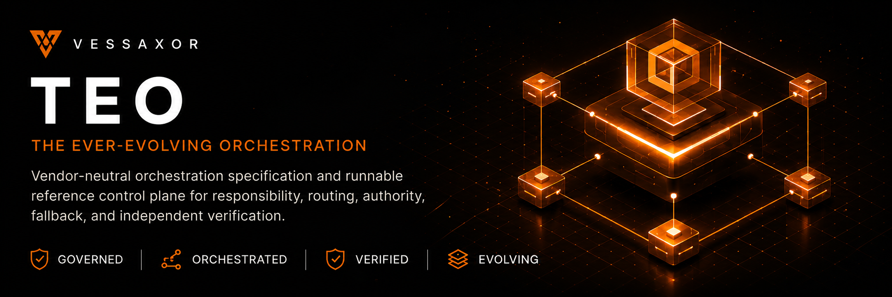

<a id="readme-top"></a>

<p align="center">
  
</p>

<div align="center">

# The Ever-Evolving Orchestration

### Models evolve. Responsibilities endure.

A vendor-neutral orchestration specification and runnable reference control plane for deciding **who should own the work, what capabilities are required, which currently eligible implementation should execute, how fallback should behave, and what evidence is required before completion**.

[](https://github.com/vessaxor-spec/The-ever-evolving-orchestration-/actions/workflows/reference-ci.yml)
[](https://github.com/vessaxor-spec/The-ever-evolving-orchestration-/releases/tag/v1.0.0)

[**Specification**](docs/specification/lexicon.md) ·
[**Reference router**](reference/implementations/python/README.md) ·
[**Current progress**](docs/stewardship/progress-tracker.md) ·
[**Roadmap**](docs/stewardship/roadmap.md)

**Stable:** `v1.0.0` · **State:** `reference_operational` · **Development:** `teo-reference-router==1.0.1.dev0`

</div>

---

## About TEO

TEO is an orchestration control plane. It separates durable responsibility, risk, authority, capability, fallback, and verification semantics from temporary model/provider implementations.

Its governing premise is:

> **The model is not the architecture.**

Its runtime-binding invariant is:

> **TEO routes capabilities and responsibility, not model brands.**

TEO is designed to remain useful as models, providers, local runtimes, connection methods, versions, and deployment environments change.

## How TEO works

The current executable control path is:

```text
Task
  -> Effective risk
  -> Mission Control
  -> Team
  -> Worker
  -> Optional Specialist
  -> Required capabilities
  -> Runtime inventory
  -> Eligibility
  -> Calibration
  -> Best-fit selection / scoped pin
  -> Execution
  -> Observed runtime identity
  -> Independent verification
  -> Evidence-bearing outcome
```

Candidate implementations move through a strict lifecycle:

**Discovered -> Eligible -> Calibrated -> Selected**

Discovery, availability, calibration evidence, fitness scores, compatibility defaults, and pins do not create authority. Selection occurs only inside the already-authorized set.

### Responsibility is model-neutral

Teams, Workers, Specialists, task routes, risk, and authority do not own concrete model/provider identity.

Current responsibility and runtime-binding surfaces are separated deliberately:

- `community/workers/workers.yaml` — Worker responsibility and capability structure;
- `policy/routing/core/routing.yaml` — model-neutral task/responsibility routing;
- `policy/routing/core/specialist-selection-policy.yaml` — model-neutral specialist selection policy;
- `policy/routing/core/runtime-compatibility-defaults.yaml` — explicit named implementation compatibility/default evidence;
- runtime inventory / eligibility / calibration / selection ports — actual runtime binding.

The retired `specialist-model-routing.yaml` is not a current authority surface.

Named implementations may still appear where names are materially required: compatibility/default evidence, provider/model registries, experiments, explicit scoped pins, reproduction, incident mitigation, examples, fixtures, provider adapters, or evidence records. Those names do not become responsibility identity.

### Runtime inventory does not equal runtime truth

The default configured compatibility bridge represents configured implementations as `user_declared` compatibility inputs. It does **not** claim those implementations are currently running, reachable, healthy, available to a particular account, or empirically calibrated.

Installations may inject a provider-independent runtime inventory, eligibility evidence source, calibration history, and fitness evidence through the runtime-binding ports. Local and remote implementations are peers unless explicit policy says otherwise.

### Observed identity matters

TEO records intended execution identity separately from independently observed executor/checker identity. A selected model name is not enough to prove what actually ran.

Observed identity may be `match`, `mismatch`, or `unconfirmed`. Mismatch or unconfirmed identity cannot be silently promoted to a verified completed outcome. Exact execution-configuration identity is not fabricated when the provider attests only model/provider identity.

## What TEO owns

| TEO owns | TEO deliberately does not own |
|---|---|
| responsibility resolution | provider accounts, subscriptions, or billing |
| effective-risk interpretation | API keys, OAuth sessions, service-account lifecycle, or credential brokering |
| Team / Worker / optional Specialist assignment | host identity or host-native permissions |
| required capabilities | generic sandbox/container/deployment infrastructure |
| runtime eligibility/calibration/selection policy | permission to widen task or live-execution authority |
| bounded fallback/escalation | a universal permanent model ranking |
| independent verification | provider credential provisioning |
| evidence-aware finalization | production distributed scheduling by implication |

## Connection neutrality

Provider access is intentionally separate from routing semantics.

API keys, OAuth or subscription-backed sessions, delegated identity, service accounts, connector sessions, SDK-managed identity, credential brokers, local runtimes, and future provider-supported access methods must not change the selected Team, Worker, Specialist, model role, fallback, verifier, or reasoning effort merely because the access mechanism differs.

A missing credential or entitlement is an access-boundary condition, not proof that a different model was intrinsically the correct route.

See [`docs/specification/provider-access-boundary.md`](docs/specification/provider-access-boundary.md) and [`policy/governance/provider-access-separation.yaml`](policy/governance/provider-access-separation.yaml).

## Current state

TEO has crossed the functional-v1 boundary and is in post-v1 stewardship and controlled evolution.

| Surface | Current state |
|---|---|
| Stable release | [`v1.0.0`](https://github.com/vessaxor-spec/The-ever-evolving-orchestration-/releases/tag/v1.0.0), `reference_operational` |
| Development line | `teo-reference-router==1.0.1.dev0` |
| Current executable main | `3d121fde56f840bbfaa6bcb240c262f045525786` after RMI-7 / PR #208 |
| Runtime model binding | RMI-1 through RMI-7 merged; RMI-8 documentation reconciliation is the remaining runtime-binding gate |
| Current qualification | Reference Implementation CI #951: **1,113 tests**, **602 tracked-file layout checks**, **42 schemas**, regulated-specialist evidence pass, linked configuration valid with zero issues, provider-diverse end-to-end pass |
| Organizational topology | ten active organizational teams, 84 workers, 82 preserved specialist role cards, dedicated Mission Control workers for orchestration, operations, project delivery, and incident response |
| Guarded live execution | bounded `high_volume_simple` canary at low or medium effective risk |
| Staged live candidate | `documentation`, evaluation only, no live-execution authority |
| High and critical live execution | not authorized |
| Regulated specialist evidence | stability-qualified six-card pilot; seven-day source-resolution cadence remains active; expansion requires explicit next risk-tier batch approval |
| Current operational priority | evidence-governed live execution expansion |

The active specialist topology includes [`community/specialists/workforce-expansion-active.yaml`](community/specialists/workforce-expansion-active.yaml). Route-Outcome Evidence, the Benchmark and Outcome Lab, Source-backed Cost Attribution, Shadow Route Evaluation, and the Qualified-human approval lifecycle have completed their current declared milestones.

## Runtime model binding history

The runtime-model-binding program is tracked in Issue #200.

- RMI-1: provider-independent runtime-binding contracts and inventory.
- RMI-2: multi-source runtime inventory composition.
- RMI-3: provider-independent eligibility evidence.
- RMI-4: exact execution-configuration calibration history and freshness.
- RMI-5: best-fit runtime selection, scoped pins, and production dispatch cutover.
- RMI-6: observed executor/checker runtime identity through telemetry, Route-Outcome, finalization, and provenance.
- RMI-7: model-neutral responsibility routes and explicit runtime compatibility/default surfaces.
- RMI-8: canonical documentation/progress reconciliation.

RMI-7 merged via PR #208 as `3d121fde56f840bbfaa6bcb240c262f045525786`. Exact-head CI #951 qualified the change with 1,113 tests, 602 tracked files, 42 schemas, valid linked configuration, regulated-specialist evidence, and provider-diverse end-to-end routing.

## Live execution boundary

Runtime model binding does not widen live authority.

The current `high_volume_simple` low or medium risk canary remains the only accepted guarded live execution scope. `documentation` is the first staged candidate; its staged replay harness and operator path are validated, but provider-backed replay evidence is still pending and it has no live-execution authority.

**The next gate is provider-backed controlled documentation replay evidence.**

CI conformance with deterministic fake provider transports does not count as empirical provider-backed evidence. High and critical live execution remains outside the current guarded runtime.

## Evidence and verification

A successful provider call is not a completed TEO outcome. Completion may require route-outcome evidence, artifact integrity, observed runtime identity, provider-diverse verification, and separately required qualified-human authority.

Key controls include:

- non-lowerable effective risk;
- provider/model deny-wins constraints;
- preview-model explicit acceptance;
- bounded retries and canonical redispatch for fallback;
- provider-family circuit state separated from tenant entitlement/access state;
- content-free runtime telemetry by default;
- exact artifact-bound finalization;
- provider-diverse independent verification;
- observed executor/checker identity integrity;
- qualified-human approval where policy independently requires it.

## Model freshness

Pretrained, cached, remembered, or previously documented model information is not authoritative for current model state.

Before recommending or changing a model-bearing compatibility/evidence/default surface, verify current authoritative provider documentation under [`policy/governance/model-freshness.yaml`](policy/governance/model-freshness.yaml).

A newer model does not automatically replace an existing route or compatibility default. Fresh releases trigger review, not automatic authority changes.

## Host Integration research

The Host Integration Contract remains non-normative research and does not widen current live scope.

The current research record contains **eleven provider-independent adversarial slices** plus integrated Fresh-AI assimilation/conformance. The latest consolidated historical research baseline remains **Reference Implementation CI #739** with **964 automated tests** and **543 tracked-file layout checks** for that research milestone; this is historical Host Integration evidence, not the current whole-repository validation baseline.

Satisfied research slices include **brokered conformant process-lifetime cross-process authority/replay**, **static runtime-wired authority-surface reconciliation**, **verifier-context independence**, **exact artifact/change-set stale-PASS resistance**, **process-lifetime recursion resistance**, **exact local freshness binding**, and **portfolio/task-admission separation**.

The governing integration principle is **Assimilation is not installation**. Process-local assimilation evidence requires continued use on **two distinct post-assimilation task IDs** rather than treating one successful demo as durable continuity.

Empirical Fresh-AI trial 001 supports fresh-session/no-reminder **routing continuity**, but not full end-to-end selected-executor/verifier assimilation. Research simulation may support `routing_continuity_only`; authenticated selected-versus-observed executor/verifier identity plus artifact/digest binding remains required for a stronger claim. The earlier **red-canary CI #676** is preserved as research evidence rather than hidden.

Key research records include:

- [`research/runtime/host-integration-verifier-artifact-binding-2026-08-12.md`](research/runtime/host-integration-verifier-artifact-binding-2026-08-12.md)
- [`research/runtime/host-integration-cross-process-authority-2026-08-13.md`](research/runtime/host-integration-cross-process-authority-2026-08-13.md)
- [`research/runtime/host-integration-authority-surface-reconciliation-2026-08-14.md`](research/runtime/host-integration-authority-surface-reconciliation-2026-08-14.md)
- [`research/runtime/host-integration-recursion-resistance-2026-08-14.md`](research/runtime/host-integration-recursion-resistance-2026-08-14.md)
- [`research/runtime/host-integration-freshness-binding-2026-08-14.md`](research/runtime/host-integration-freshness-binding-2026-08-14.md)
- [`research/runtime/host-integration-portfolio-authority-separation-2026-08-15.md`](research/runtime/host-integration-portfolio-authority-separation-2026-08-15.md)
- [`research/roadmaps/host-integration-assimilation-protocol.md`](research/roadmaps/host-integration-assimilation-protocol.md)
- [`research/roadmaps/host-integration-fresh-session-trial.md`](research/roadmaps/host-integration-fresh-session-trial.md)
- [`research/runtime/host-integration-integrated-conformance-assimilation-2026-08-15.md`](research/runtime/host-integration-integrated-conformance-assimilation-2026-08-15.md)
- [`research/runtime/2026-08-15-local-fresh-ai-cross-session-trial-001.md`](research/runtime/2026-08-15-local-fresh-ai-cross-session-trial-001.md)

## Accepted future research

Current non-normative accepted research directions include:

- Host Integration Contract;
- Execution Environment & Recovery;
- Task Intent & Action Authority.

These research tracks do not silently alter Task Request authority, provider routing, specialist responsibility, qualified-human approval, live scope, or the stable v1 contract.

## Quick start

### Prerequisites

- Python **3.11+**
- Git

### Install

```bash
git clone https://github.com/vessaxor-spec/The-ever-evolving-orchestration-.git
cd The-ever-evolving-orchestration-
python -m pip install -e '.[test]'
```

### Validate linked configuration

```bash
teo --repo-root . validate
```

### Plan a dispatch

```bash
teo --repo-root . plan \
  reference/examples/phase5-task.yaml \
  --output /tmp/teo-dispatch.json \
  --audit-log /tmp/teo-audit.jsonl
```

## Repository map

- [`CONSTITUTION.md`](CONSTITUTION.md) — enduring project principles.
- [`AI_INSTRUCTIONS.md`](AI_INSTRUCTIONS.md) — repository operating instructions for AI agents.
- [`docs/specification/`](docs/specification/) — canonical concepts and contracts.
- [`policy/`](policy/) — machine-readable routing, runtime, governance, and authority policy.
- [`registry/`](registry/) — capabilities, implementations, and evidence/catalog data.
- [`community/`](community/) — Teams, Workers, and Specialist role definitions.
- [`reference/implementations/python/`](reference/implementations/python/) — runnable reference implementation.
- [`docs/stewardship/progress-tracker.md`](docs/stewardship/progress-tracker.md) — canonical current progress.
- [`docs/stewardship/roadmap.md`](docs/stewardship/roadmap.md) — strategic direction.
- [`research/`](research/) — non-normative research and future-roadmap evidence.

## Governance

Repository truth outranks remembered state. Material architectural or behavioral claims should be evidence-backed, current where freshness matters, independently checked where consequence warrants it, and reconciled into canonical documentation only after executable truth exists.

The stable release remains `v1.0.0`; post-v1 development does not retroactively change the released artifact.
